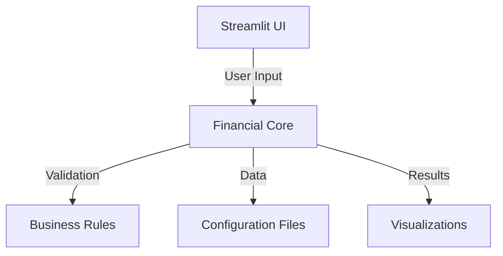

# System Patterns

## Core Architectural Components

## Key Data Flows
1. **User Input Flow**:
   - UI collects parameters → Core processes → Returns calculations → UI displays

2. **Configuration Flow**:
   - Core loads charger/car specs → Applies to models → Generates projections

3. **Risk Analysis Flow**:
   - Core runs scenarios → Aggregates results → Viz shows distributions

## Design Patterns in Use
1. **Strategy Pattern**:
   - Different calculation methods for single vs multi-investor scenarios
   - Swappable risk models (optimistic/cautious/high-risk)

2. **Observer Pattern**:
   - Streamlit's reactive components notify core of changes
   - Core updates all dependent calculations

3. **Facade Pattern**:
   - Simplified interface (`calculate_profits()`) hides complex financial logic

## Component Relationships
1. **Financial Core**:
   - Depends on: Configuration files, Validation rules
   - Provides: Calculation results to UI

2. **UI Layer**:
   - Depends on: Financial Core
   - Provides: User interaction points

3. **Validation**:
   - Used by: Core before calculations
   - Ensures: Business rule compliance

## Key Integration Points
1. **Configuration Files**:
   - JSON structure must match core expectations
   - Field names are contract between files and code

2. **Visualization Data**:
   - Plotly expects specific dataframe formats
   - Core must structure results accordingly

## Performance Considerations
- Heavy calculations cached with Streamlit
- Configuration files loaded once at startup
- Risk scenarios run in parallel where possible
