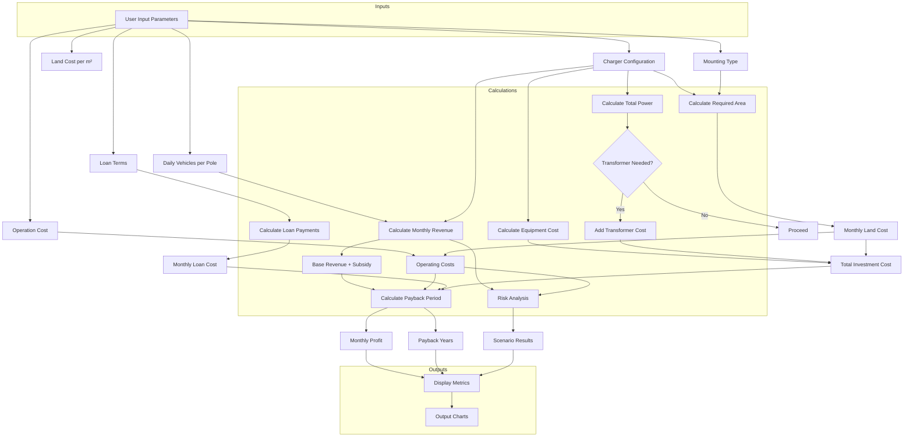

### Key Components:
1. **Input Parameters**:
   - Charger types/quantities
   - Land cost, mounting type
   - Loan terms (amount, rate, duration)
   - Operation costs
   - Daily vehicle traffic

2. **Core Calculations**:
   - **Equipment Costs**: Sum of charger costs + transformer (if power >560kW)
   - **Space Requirements**: Calculated based on mounting type and charger quantities
   - **Revenue Model**: 
     - Energy consumption × electricity pricing
     - Government subsidies
   - **Loan Amortization**: Monthly payment calculations
   - **Payback Analysis**: 
     ```python
     (Total Investment) / (Monthly Revenue - Operating Costs - Loan Payments)
     ```
   - **Risk Scenarios**: Sensitivity analysis with ±20% revenue/cost variations

3. **Outputs**:
   - Key metrics: Total investment, monthly profit, payback period
   - Visualizations: 
     - Cumulative profit vs time chart
     - Risk scenario comparison bars
   - Validation alerts: Space requirements, safety compliance

4. **Data Flow**:
   User inputs → Configuration validation → Financial calculations → Risk modeling → Visualization rendering

This flow chart shows how user inputs propagate through different calculation modules to produce both numerical results and visual outputs used for investment decision-making.