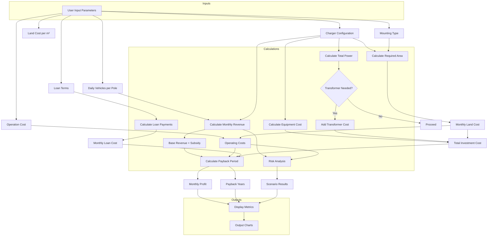

### Key Components:
1. **Input Parameters**:
   - Charger types/quantities
   - Land cost, mounting type
   - Loan terms (amount, rate, duration)
   - Operation costs
   - Daily vehicle traffic

2. **Core Calculations**:
   - **Equipment Costs**: Sum of charger costs + transformer (if power >560kW)
   - **Space Requirements**: Calculated based on mounting type and charger quantities
   - **Revenue Model**: 
     - Energy consumption × electricity pricing
     - Government subsidies
   - **Loan Amortization**: Monthly payment calculations
   - **Payback Analysis**: 
     ```python
     (Total Investment) / (Monthly Revenue - Operating Costs - Loan Payments)
     ```
   - **Risk Scenarios**: Sensitivity analysis with ±20% revenue/cost variations

3. **Outputs**:
   - Key metrics: Total investment, monthly profit, payback period
   - Visualizations: 
     - Cumulative profit vs time chart
     - Risk scenario comparison bars
   - Validation alerts: Space requirements, safety compliance

4. **Data Flow**:
   User inputs → Configuration validation → Financial calculations → Risk modeling → Visualization rendering

This flow chart shows how user inputs propagate through different calculation modules to produce both numerical results and visual outputs used for investment decision-making.

### Other note

```
Chi phí sạc tại trạm công cộng 	Mức phí trung bình khoảng 3.117,4 đồng/kWh, có thể thay đổi tùy loại dịch vụ. Phí phát sinh 1.000 đồng/phút sau phút thứ 31 nếu sạc quá giờ.

---------------

Chi phí sạc tại trạm sạc công cộng

Việc sạc tại các trạm sạc công cộng của VinFast có mức giá trung bình khoảng 3.117,4 đồng/kWh, tuy nhiên chi phí này có thể thay đổi tùy theo từng thời điểm và loại dịch vụ mà khách hàng lựa chọn. Đặc biệt, có mức phí phát sinh cho trường hợp sạc quá giờ. Dưới đây là thông tin chi tiết:

    Mức phí sạc:
        Sạc nhanh DC (150kW): 3.500 VNĐ/kWh (xấp xỉ).
        Sạc thường AC (11kW): 2.500 VNĐ/kWh (xấp xỉ).
    Phí phát sinh: 1.000 VNĐ/phút sau phút thứ 31 nếu sạc quá giờ.

---------------

Loại sạc 	Giá sạc (VNĐ/kWh) 	Thời gian (cho 100km)
Sạc nhanh DC 	3.500 	Khoảng 30 phút
Sạc thường AC 	2.500 	4-9 giờ

---------------

Để tính chi phí sạc tại nhà, bạn cần biết dung lượng pin xe (kWh), giá điện sinh hoạt (đồng/kWh), và hiệu suất sạc. Công thức tính: Chi phí = (Dung lượng pin / Hiệu suất sạc) x Giá điện. Ví dụ, với pin 50kWh, hiệu suất sạc 90%, giá điện 2000đ/kWh, chi phí sạc đầy sẽ là: (50 / 0.9) x 2000 = 111,111 đồng.

---------------

Chọn khung giờ sử dụng trạm sạc

Như vậy, với Đơn giá sạc: 3.858 VNĐ/kWh áp dụng từ ngày 19/03/2024 của VINFAST, bạn được hưởng doanh thu 750 VNĐ/kWh. Khi kết hợp kinh doanh trạm sạc, bạn nên sạc ở:

    khung giờ bình thường và
    khung giờ thấp điểm


```